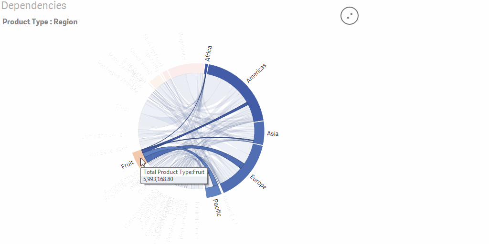

Qlik Sense Extensions Dependency Wheel
======================================

This extension visualizes dependencies between two dimensions using an interactive disc. Each disc section represents a dependency, and links between arcs materialize these dependencies. All rendering is done client-side, in JavaScript. Built with <a href="https://github.com/mbostock/d3">d3.js</a> and Francois Zaninotto's <a href="http://fzaninotto.github.com/DependencyWheel">d3.dependencyWheels.js</a>, published with the MIT open-source license.

This extension was created on the 1st Qlik Hackathon during Qonnections 2014 in Orlando.

Update:
1 fixed some data aggregation issues
2 added selection capability on groups and links